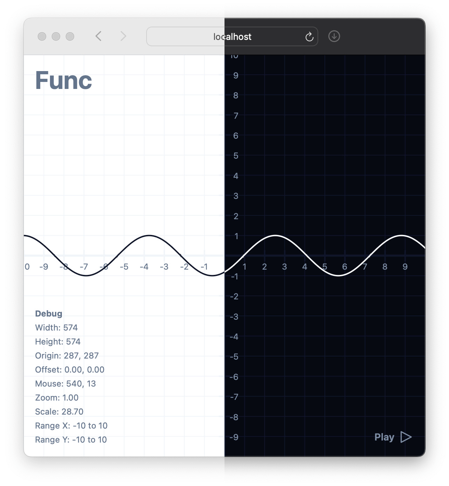

# Func



## Concepts

### Functions

Func is built around the concept of functions. A function is a mathematical relation that maps a set of inputs to a set of outputs. In the context of Func, a function takes a single argument `x: number` and returns a single value `y: number`: `f: (x: number) => number`.

> [!NOTE]
> Note that a function can be anything from a simple linear or quadratic function to more complex functions (e.g., trigonometric functions, exponential functions, etc.).

### Animations

An animation essentially is a function of input over time. It is defined by a function `f: (x: number) => number` and a duration `duration: number`, where `duration` is the total time it takes for the animation to complete. The animation function `f` is then evaluated at each time step `t` in a given range `[n, m]` to produce a value `y: number`.

### Components

Func provides a set of React components that can be used to create animations and visualizations. The core components are:

- `Func`: The main component that wraps the entire application.
- `Canvas`: A container for drawing primitives like lines, points, and functions.
- `Controls`: A container for controls (optional).
  - `AnimationControls`: Controls for starting, stopping an animation (optional).

Apart from the core components, Func also provides a set of primitives that can be used to create visualizations:

- `Point`: A visual representation of a point,
- `Line`: A visual representation of a line,
- `Area`: A visual representation of an area,
- `Function`: A visual representation of a function (e.g., a line, curve, etc.).

## Getting Started

### Prerequisites

Make sure you have the following installed:

- Node.js (version 14 or higher)
- pnpm

### Installation

1. Clone the repository:

   ```bash
   git clone https://github.com/leonmeka/func.git
   cd func
   ```

2. Install the dependencies:

   ```bash
   pnpm install
   ```

### Development

To start the development server with hot module replacement (HMR), run:

```bash
pnpm run dev
```

Open your browser and navigate to `http://localhost:3000` to open the application.

## Usage

To use the library in your React application, import the necessary components and hooks:

```typescript
import { Func } from "./components/func/func";
import { Canvas } from "./components/primitives/canvas";
import { Function } from "./components/primitives/function";
import { Point } from "./components/primitives/point";

import { Controls } from "./components/controls/controls"; // (optional)
import { AnimationControls } from "./components/controls/animation-controls"; // (optional)

import { useAnimation } from "./hooks/use-animation";
```

Then, you can use the components and hooks in your application:

```typescript
export const App = () => {
  // Define the animation function
  const f = (x: number) => x * Math.sin(x) + Math.cos(x);

  // Setup the animation
  const animation = useAnimation({
    y: f,
    duration: 5_000, // = 5s
    range: [-10, 10], // = [-10 -> 10] on x-axis
  });

  return (
    <div className="w-dvw h-dvh">
      <Func>
        <Canvas>
          {/* Visualize the animation function */}
          <Function y={f} color="muted" />

          {/* Visualize an animated point */}
          <Point point={{ x: animation.x, y: animation.y }} />
        </Canvas>

        <Controls>
          <AnimationControls animation={animation} />
        </Controls>
      </Func>
    </div>
  );
};
```

This is a simple example of how you can create an animated point that moves along a given function. Of course, this also works with any other primitive component like `Line`, `Area` or even a `Function`.

Since the library is built around the concept of functions, this can get quite powerful. This effectively allows you to animate a function with another function, or even a function with multiple functions.

Here's an example of animating a function with another function:

```typescript
export const App = () => {
  // Define the base function
  const f = (x: number) => Math.sin(x);

  // Define the animation function
  const g = (x: number) => x ** 2 * animation.y;

  // Setup the animation
  const animation = useAnimation({
    y: f,
    duration: 5_000, // = 5s
    range: [-10, 10], // = [-10 -> 10] on x-axis
  });

  return (
    <div className="w-dvw h-dvh">
      <Func>
        <Canvas>
          {/* Visualize the functions */}
          <Function y={f} color="muted" />
          <Function y={g} />

          {/* Visualize an animated point */}
          <Point point={{ x: animation.x, y: animation.y }} />
        </Canvas>

        <Controls>
          <AnimationControls animation={animation} />
        </Controls>
      </Func>
    </div>
  );
};
```

## Advanced Usage

### Operations

Func provides a set of operation functions that can be used to combine multiple functions into a single function. The operation functions are:

- `Operation.COMPOSE`: Composes two functions.
- `Operation.ADD`: Adds two functions.
- `Operation.SUBTRACT`: Subtracts two functions.
- `Operation.MULTIPLY`: Multiplies two functions.
- `Operation.DIVIDE`: Divides two functions.

```typescript
// ...

import { Operations } from "./utils/operations";

// Define the base functions
const f = (x: number) => Math.sin(x);
const g = (x: number) => Math.cos(x);

// Apply the compose operation
const h = Operations.COMPOSE(f, g);

// ...
```

### Transformations

Since we're working with functions, we can also apply transformations to them. These transformations can be used to scale, translate, or rotate a function. The transformation functions are:

- `Transformation.IDENTITY`: The identity transformation.
- `Transformation.TRANSLATE`: Translates a function.
- `Transformation.REFLECT`: Reflects a function.
- `Transformation.SCALE`: Scales a function.
- `Transformation.ROTATE`: Rotates a function.
- `Transformation.SHEAR`: Shears a function.

```typescript
// ...

import { Transformations } from "./utils/transformations";

// Define the base function
const f = (x: number) => Math.sin(x);

// Apply the translate transformation
const g = Transformations.TRANSLATE(f, 2, 0);

// ...
```

Both operations and transformations can be coupled with animations to create even more complex visualizations.

## Contributing

If you have suggestions for improvements or new features, please open an issue or submit a pull request.

1. Fork the repository.
2. Create a new branch for your feature or bug fix.
3. Make your changes and commit them.
4. Push your branch to your forked repository.
5. Open a pull request.

## License

This project is licensed under the MIT License. See the [LICENSE](LICENSE) file for details.
